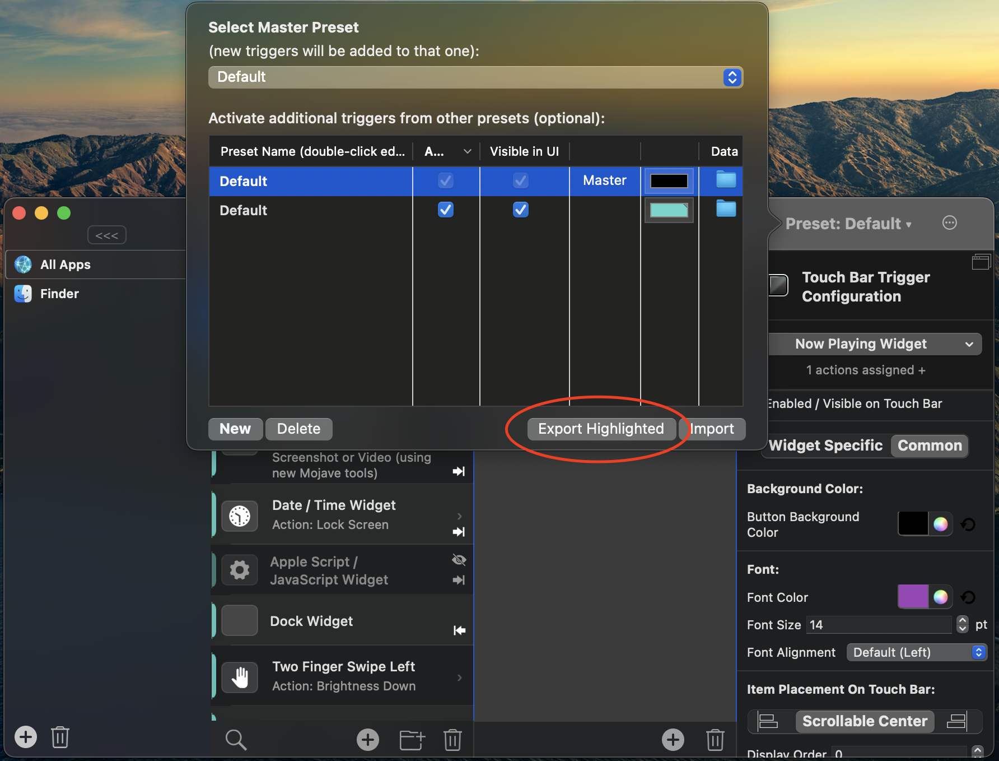

# upd: not working as of 25.09.2024
# btt_reset_trial
Reset trial time for Better Touch Tool

save your preset  

`kill $(ps aux | grep 'BetterTouchTool' | awk '{print $2}')`

`rm -rf ~/Library/Preferences/com.hegenberg.BetterTouchTool.plist`

`rm -rf ~/Library/Application\ Support/BetterTouchTool/`

`rm -rf /Applications/BetterTouchTool.app`

And now you can install it again!  
`brew install --cask bettertouchtool`
